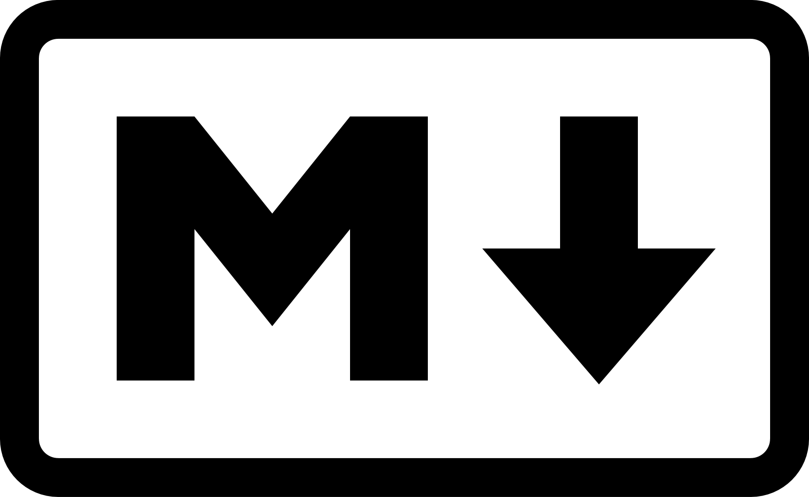

# Quick Markdown Guide <!-- omit in toc -->

<!-- this is a comment, but Visual Studio Code (VSC) and its extensions can still read it as action -->

# This is Title

## Table of Contents <!-- omit in toc -->

- [This is Title](#this-is-title)
  - [This is Chapter](#this-is-chapter)
    - [This is Subchapter](#this-is-subchapter)
  - [Basic Features](#basic-features)
  - [Extended Features](#extended-features)

## This is Chapter

This is a paragraph of text.

### This is Subchapter

How do `enter`, `double enter` and `double space and enter` commands work?

- `enter` - no visible action;  
- `double enter` - new paragraph;  
- `double space and enter` - new line without creating a new paragraph.

## Basic Features

This text is *italics*.  
This text is **bold**.  
This text is ~~crossed out~~.

---

> This is a blockquote.  
This is still a blockquote.  
This is the end of the blockquote.

---

Numbered list:
1. First item
2. Second item
3. Third item

---

Bulleted list:
- First item
- Second item
- Third item

---

To-do list
- [x] Write a Quick Guide
- [ ] Update the website
- [ ] Prepare your portfolio

---

`This text is used to write code or mathematical formulas.`

---

Two examples of using links:

[Markdown Cheat Sheet](https://www.markdownguide.org/cheat-sheet/)  
or  
[https://www.markdownguide.org/cheat-sheet/](https://www.markdownguide.org/cheat-sheet/)

---

Adding an image: 



## Extended Features

Code block:
```
started_in = os.getcwd()
    download_content(terminology_url, terminology_languages)
    os.chdir(started_in)
```

---
Mathematical expressions:

When $a \ne 0$, there are two solutions of $(ax^2 + bx + c = 0)$ and they are 

$$
x = {-b \pm \sqrt{b^2-4ac} \over 2a} 
$$

---

Tables:

| Heading text | Definition text |
| ------------ | --------------- |
| Item A       | Definition of A |
| Item B       | Definition of B |

Variations with text alignment in the table to the right, left and center:

| Right alignment                    |                    Left alignment |      Center       |
| :--------------------------------- | --------------------------------: | :---------------: |
| Text on the right | Text on the left | Text in the middle |

---
---

Source: [Markdown Cheat Sheet](https://www.markdownguide.org/cheat-sheet/) 
